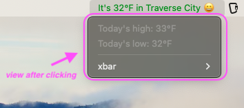

## The Honeymaker

**_Classic snake game—reimagined with 100% more honey_**

  

<em><a href="https://youtu.be/zJtuD3XLpzc" target="_blank">Click the animation above to watch an 83-second game walkthrough on YouTube</a></em>

**A whimsical web-based snake game**  
Features OAuth login, user scores, and a playful bee & honey theme. Focus on design and DOM fundamentals (no frameworks, no libraries) - vanilla JS, CSS, & HTML.

_Game Stills_

[_Backend Code Repo_](https://github.com/John-Plough/snake-api.git)&nbsp;&nbsp;&nbsp;**|**&nbsp;&nbsp;&nbsp;[_Frontend Code Repo_](https://github.com/John-Plough/honeymaker.git)

**I Learned**: Integrated OAuth, managed game state with vanilla JS, and designed UI/UX. Docker and AWS deployment planned next.

  
 
  

---

## Queue•pid

**_A match based on taste—not just thirst_**

**A mobile-first dating app based around TV taste**  
Users log shows they love, shows they'll rewatch, and shows they want to experience with a partner. Plans include an AI-powered matching algorithm based on shared preferences.

**Learned**: Deepened experience with third-party APIs and began prototyping a matching algorithm based on user preferences and powered by AI.

  
  

---

## TAKING CARE OF BUSINESS

**_Know before you go_**

<table>
  <tr>
    <td align="center">
       
      <em>iOS Open Screen</em>
    </td>
    <td align="center">
       
      <em>iOS Map View</em>
    </td>
  </tr>
</table>

**A civic mapping app for public resources**  
Maps restrooms, trash bins, water fountains, and pet waste stations using geospatial data and Google Maps overlays.

**Learned**: Implemented geospatial queries and real-time map overlays. Strengthened skills in API integration and public-data visualization.

<!--  
 
 
 
 -->

  
  
  

---

## Thresh Mercantile

**_A rotating selection of curated goods for the quietly discerning_**

<table>
  <tr>
    <td align="center">
       
      <em>Products Page</em>
    </td>
    <td align="center">
       
      <em>Dynamic Cart</em>
    </td>
  </tr>
</table>

**A full-featured e-commerce application**  
Includes shopping cart, order history, admin dashboard, and access control.

**Learned**: Built a full shopping experience with admin functionality. Strengthened understanding of MVC, database design, and user permissions.

  
 
  

---

## Weather Bar

**_Quick weather. No clutter._**

<table>
  <tr>
    <td align="center">
       
      <em>Menu Bar</em>
    </td>
    <td align="center">
       
      <em>Drop Down</em>
    </td>
  </tr>
</table>

**A lightweight macOS menu bar utility**  
Displays live weather info using Zsh scripting and xbar plugin architecture.

**Learned**: Explored shell scripting, API polling, and formatting output for native desktop utility integration.

 

---

> Want to learn more? Visit [john-plough.github.io](https://john-plough.github.io).
